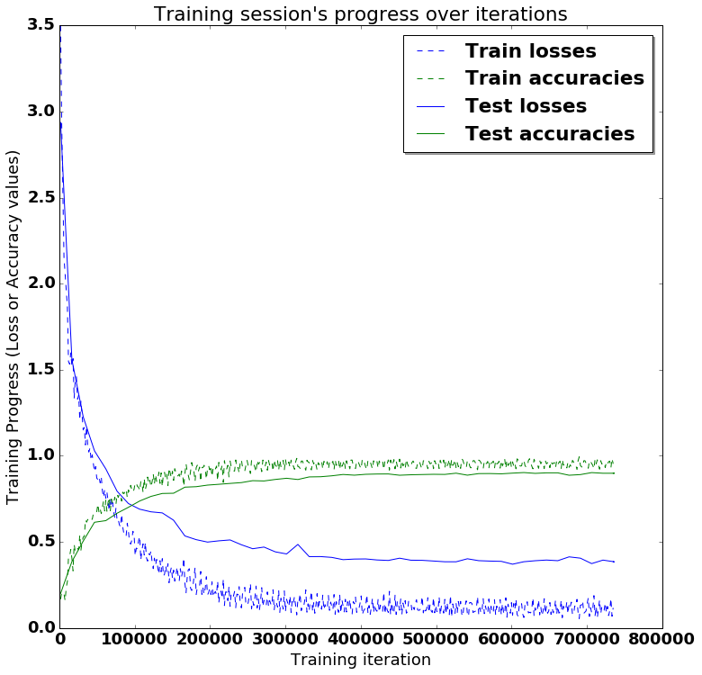
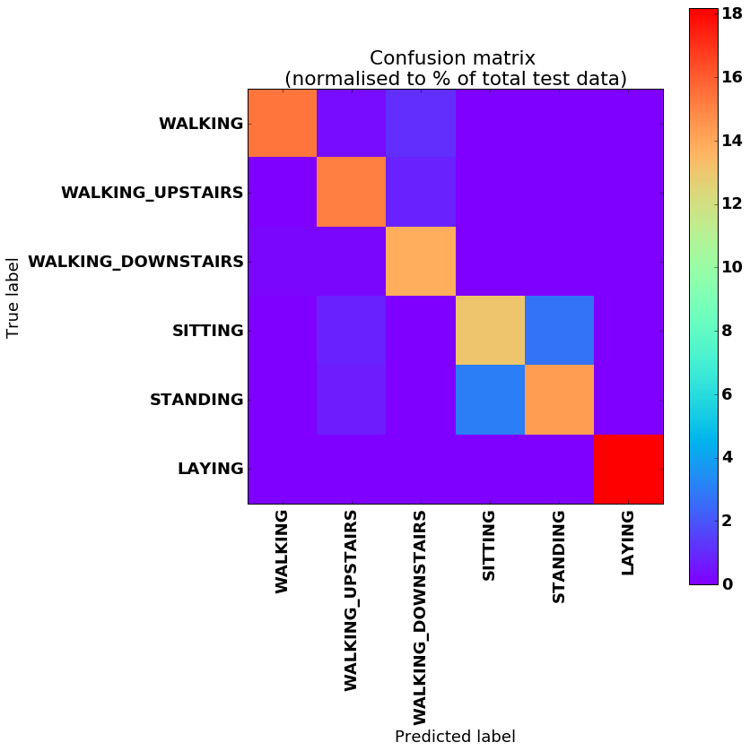

# LSTMs for Human Activity Recognition

Human activity recognition using smartphones dataset and an LSTM RNN. Classifying the type of movement amongst six categories:
- WALKING,
- WALKING_UPSTAIRS,
- WALKING_DOWNSTAIRS,
- SITTING,
- STANDING,
- LAYING.

Compared to a classical approach, using a Recurrent Neural Networks (RNN) with Long Short-Term Memory cells (LSTMs) require no or almost no feature engineering. Data can be fed directly into the neural network who acts like a black box, modeling the problem correctly. Other research on the activity recognition dataset used mostly use a big amount of feature engineering, which is rather a signal processing approach combined with classical data science techniques. The approach here is rather very simple in terms of how much did the data was preprocessed. 

## Video dataset overview

Follow this link to see a video of the 6 activities recorded in the experiment with one of the participants:

<p align="center">
  <a href="http://www.youtube.com/watch?feature=player_embedded&v=XOEN9W05_4A
" target="_blank"></a>
  <a href="https://youtu.be/XOEN9W05_4A"><center>[Watch video]</center></a>
</p>

## Details about input data

I will be using an LSTM on the data to learn (as a cellphone attached on the waist) to recognise the type of activity that the user is doing. The dataset's description goes like this:

> The sensor signals (accelerometer and gyroscope) were pre-processed by applying noise filters and then sampled in fixed-width sliding windows of 2.56 sec and 50% overlap (128 readings/window). The sensor acceleration signal, which has gravitational and body motion components, was separated using a Butterworth low-pass filter into body acceleration and gravity. The gravitational force is assumed to have only low frequency components, therefore a filter with 0.3 Hz cutoff frequency was used. 

That said, I will use the almost raw data: only the gravity effect has been filtered out of the accelerometer  as a preprocessing step for another 3D feature as an input to help learning. 

## What is an RNN?

As explained in [this article](http://karpathy.github.io/2015/05/21/rnn-effectiveness/), an RNN takes many input vectors to process them and output other vectors. It can be roughly pictured like in the image below, imagining each rectangle has a vectorial depth and other special hidden quirks in the image below. **In our case, the "many to one" architecture is used**: we accept time series of feature vectors (one vector per time step) to convert them to a probability vector at the output for classification. Note that a "one to one" architecture would be a standard feedforward neural network. 


An LSTM is an improved RNN. It is more complex, but easier to train, avoiding what is called the vanishing gradient problem. 


## Results 

Scroll on! Nice visuals awaits. 


```python
# All Includes

import numpy as np
import matplotlib
import matplotlib.pyplot as plt
import tensorflow as tf  # Version 1.0.0 (some previous versions are used in past commits)
from sklearn import metrics

import os
```


```python
# Useful Constants

# Those are separate normalised input features for the neural network
INPUT_SIGNAL_TYPES = [
    "body_acc_x_",
    "body_acc_y_",
    "body_acc_z_",
    "body_gyro_x_",
    "body_gyro_y_",
    "body_gyro_z_",
    "total_acc_x_",
    "total_acc_y_",
    "total_acc_z_"
]

# Output classes to learn how to classify
LABELS = [
    "WALKING", 
    "WALKING_UPSTAIRS", 
    "WALKING_DOWNSTAIRS", 
    "SITTING", 
    "STANDING", 
    "LAYING"
] 

```

## Let's start by downloading the data: 


```python
# Note: Linux bash commands start with a "!" inside those "ipython notebook" cells

DATA_PATH = "data/"

!pwd && ls
os.chdir(DATA_PATH)
!pwd && ls

!python download_dataset.py

!pwd && ls
os.chdir("..")
!pwd && ls

DATASET_PATH = DATA_PATH + "UCI HAR Dataset/"
print("\n" + "Dataset is now located at: " + DATASET_PATH)

```

    /home/ubuntu/pynb/LSTM-Human-Activity-Recognition
    data	 LSTM_files  LSTM_OLD.ipynb  README.md
    LICENSE  LSTM.ipynb  lstm.py	     screenlog.0
    /home/ubuntu/pynb/LSTM-Human-Activity-Recognition/data
    download_dataset.py  source.txt
    
    Downloading...
    --2017-05-24 01:49:53--  https://archive.ics.uci.edu/ml/machine-learning-databases/00240/UCI%20HAR%20Dataset.zip
    Resolving archive.ics.uci.edu (archive.ics.uci.edu)... 128.195.10.249
    Connecting to archive.ics.uci.edu (archive.ics.uci.edu)|128.195.10.249|:443... connected.
    HTTP request sent, awaiting response... 200 OK
    Length: 60999314 (58M) [application/zip]
    Saving to: ‘UCI HAR Dataset.zip’
    
    100%[======================================>] 60,999,314  1.69MB/s   in 38s    
    
    2017-05-24 01:50:31 (1.55 MB/s) - ‘UCI HAR Dataset.zip’ saved [60999314/60999314]
    
    Downloading done.
    
    Extracting...
    Extracting successfully done to /home/ubuntu/pynb/LSTM-Human-Activity-Recognition/data/UCI HAR Dataset.
    /home/ubuntu/pynb/LSTM-Human-Activity-Recognition/data
    download_dataset.py  __MACOSX  source.txt  UCI HAR Dataset  UCI HAR Dataset.zip
    /home/ubuntu/pynb/LSTM-Human-Activity-Recognition
    data	 LSTM_files  LSTM_OLD.ipynb  README.md
    LICENSE  LSTM.ipynb  lstm.py	     screenlog.0
    
    Dataset is now located at: data/UCI HAR Dataset/


## Preparing dataset:


```python
TRAIN = "train/"
TEST = "test/"


# Load "X" (the neural network's training and testing inputs)

def load_X(X_signals_paths):
    X_signals = []
    
    for signal_type_path in X_signals_paths:
        file = open(signal_type_path, 'r')
        # Read dataset from disk, dealing with text files' syntax
        X_signals.append(
            [np.array(serie, dtype=np.float32) for serie in [
                row.replace('  ', ' ').strip().split(' ') for row in file
            ]]
        )
        file.close()
    
    return np.transpose(np.array(X_signals), (1, 2, 0))

X_train_signals_paths = [
    DATASET_PATH + TRAIN + "Inertial Signals/" + signal + "train.txt" for signal in INPUT_SIGNAL_TYPES
]
X_test_signals_paths = [
    DATASET_PATH + TEST + "Inertial Signals/" + signal + "test.txt" for signal in INPUT_SIGNAL_TYPES
]

X_train = load_X(X_train_signals_paths)
X_test = load_X(X_test_signals_paths)


# Load "y" (the neural network's training and testing outputs)

def load_y(y_path):
    file = open(y_path, 'r')
    # Read dataset from disk, dealing with text file's syntax
    y_ = np.array(
        [elem for elem in [
            row.replace('  ', ' ').strip().split(' ') for row in file
        ]], 
        dtype=np.int32
    )
    file.close()
    
    # Substract 1 to each output class for friendly 0-based indexing 
    return y_ - 1

y_train_path = DATASET_PATH + TRAIN + "y_train.txt"
y_test_path = DATASET_PATH + TEST + "y_test.txt"

y_train = load_y(y_train_path)
y_test = load_y(y_test_path)

```

## Additionnal Parameters:

Here are some core parameter definitions for the training. 

The whole neural network's structure could be summarised by enumerating those parameters and the fact an LSTM is used. 


```python
# Input Data 

training_data_count = len(X_train)  # 7352 training series (with 50% overlap between each serie)
test_data_count = len(X_test)  # 2947 testing series
n_steps = len(X_train[0])  # 128 timesteps per series
n_input = len(X_train[0][0])  # 9 input parameters per timestep


# LSTM Neural Network's internal structure

n_hidden = 32 # Hidden layer num of features
n_classes = 6 # Total classes (should go up, or should go down)


# Training 

learning_rate = 0.0025
lambda_loss_amount = 0.0015
training_iters = training_data_count * 300  # Loop 300 times on the dataset
batch_size = 1500
display_iter = 30000  # To show test set accuracy during training


# Some debugging info

print("Some useful info to get an insight on dataset's shape and normalisation:")
print("(X shape, y shape, every X's mean, every X's standard deviation)")
print(X_test.shape, y_test.shape, np.mean(X_test), np.std(X_test))
print("The dataset is therefore properly normalised, as expected, but not yet one-hot encoded.")

```

    Some useful info to get an insight on dataset's shape and normalisation:
    (X shape, y shape, every X's mean, every X's standard deviation)
    (2947, 128, 9) (2947, 1) 0.0991399 0.395671
    The dataset is therefore properly normalised, as expected, but not yet one-hot encoded.


## Utility functions for training:


```python
def LSTM_RNN(_X, _weights, _biases):
    # Function returns a tensorflow LSTM (RNN) artificial neural network from given parameters. 
    # Moreover, two LSTM cells are stacked which adds deepness to the neural network. 
    # Note, some code of this notebook is inspired from an slightly different 
    # RNN architecture used on another dataset, some of the credits goes to 
    # "aymericdamien" under the MIT license.

    # (NOTE: This step could be greatly optimised by shaping the dataset once
    # input shape: (batch_size, n_steps, n_input)
    _X = tf.transpose(_X, [1, 0, 2])  # permute n_steps and batch_size
    # Reshape to prepare input to hidden activation
    _X = tf.reshape(_X, [-1, n_input]) 
    # new shape: (n_steps*batch_size, n_input)
    
    # Linear activation
    _X = tf.nn.relu(tf.matmul(_X, _weights['hidden']) + _biases['hidden'])
    # Split data because rnn cell needs a list of inputs for the RNN inner loop
    _X = tf.split(_X, n_steps, 0) 
    # new shape: n_steps * (batch_size, n_hidden)

    # Define two stacked LSTM cells (two recurrent layers deep) with tensorflow
    lstm_cell_1 = tf.contrib.rnn.BasicLSTMCell(n_hidden, forget_bias=1.0, state_is_tuple=True)
    lstm_cell_2 = tf.contrib.rnn.BasicLSTMCell(n_hidden, forget_bias=1.0, state_is_tuple=True)
    lstm_cells = tf.contrib.rnn.MultiRNNCell([lstm_cell_1, lstm_cell_2], state_is_tuple=True)
    # Get LSTM cell output
    outputs, states = tf.contrib.rnn.static_rnn(lstm_cells, _X, dtype=tf.float32)

    # Get last time step's output feature for a "many to one" style classifier, 
    # as in the image describing RNNs at the top of this page
    lstm_last_output = outputs[-1]
    
    # Linear activation
    return tf.matmul(lstm_last_output, _weights['out']) + _biases['out']


def extract_batch_size(_train, step, batch_size):
    # Function to fetch a "batch_size" amount of data from "(X|y)_train" data. 
    
    shape = list(_train.shape)
    shape[0] = batch_size
    batch_s = np.empty(shape)

    for i in range(batch_size):
        # Loop index
        index = ((step-1)*batch_size + i) % len(_train)
        batch_s[i] = _train[index] 

    return batch_s


def one_hot(y_):
    # Function to encode output labels from number indexes 
    # e.g.: [[5], [0], [3]] --> [[0, 0, 0, 0, 0, 1], [1, 0, 0, 0, 0, 0], [0, 0, 0, 1, 0, 0]]
    
    y_ = y_.reshape(len(y_))
    n_values = int(np.max(y_)) + 1
    return np.eye(n_values)[np.array(y_, dtype=np.int32)]  # Returns FLOATS

```

## Let's get serious and build the neural network:


```python

# Graph input/output
x = tf.placeholder(tf.float32, [None, n_steps, n_input])
y = tf.placeholder(tf.float32, [None, n_classes])

# Graph weights
weights = {
    'hidden': tf.Variable(tf.random_normal([n_input, n_hidden])), # Hidden layer weights
    'out': tf.Variable(tf.random_normal([n_hidden, n_classes], mean=1.0))
}
biases = {
    'hidden': tf.Variable(tf.random_normal([n_hidden])),
    'out': tf.Variable(tf.random_normal([n_classes]))
}

pred = LSTM_RNN(x, weights, biases)

# Loss, optimizer and evaluation
l2 = lambda_loss_amount * sum(
    tf.nn.l2_loss(tf_var) for tf_var in tf.trainable_variables()
) # L2 loss prevents this overkill neural network to overfit the data
cost = tf.reduce_mean(tf.nn.softmax_cross_entropy_with_logits(labels=y, logits=pred)) + l2 # Softmax loss
optimizer = tf.train.AdamOptimizer(learning_rate=learning_rate).minimize(cost) # Adam Optimizer

correct_pred = tf.equal(tf.argmax(pred,1), tf.argmax(y,1))
accuracy = tf.reduce_mean(tf.cast(correct_pred, tf.float32))

```

## Hooray, now train the neural network:


```python
# To keep track of training's performance
test_losses = []
test_accuracies = []
train_losses = []
train_accuracies = []

# Launch the graph
sess = tf.InteractiveSession(config=tf.ConfigProto(log_device_placement=True))
init = tf.global_variables_initializer()
sess.run(init)

# Perform Training steps with "batch_size" amount of example data at each loop
step = 1
while step * batch_size <= training_iters:
    batch_xs =         extract_batch_size(X_train, step, batch_size)
    batch_ys = one_hot(extract_batch_size(y_train, step, batch_size))

    # Fit training using batch data
    _, loss, acc = sess.run(
        [optimizer, cost, accuracy],
        feed_dict={
            x: batch_xs, 
            y: batch_ys
        }
    )
    train_losses.append(loss)
    train_accuracies.append(acc)
    
    # Evaluate network only at some steps for faster training: 
    if (step*batch_size % display_iter == 0) or (step == 1) or (step * batch_size > training_iters):
        
        # To not spam console, show training accuracy/loss in this "if"
        print("Training iter #" + str(step*batch_size) + \
              ":   Batch Loss = " + "{:.6f}".format(loss) + \
              ", Accuracy = {}".format(acc))
        
        # Evaluation on the test set (no learning made here - just evaluation for diagnosis)
        loss, acc = sess.run(
            [cost, accuracy], 
            feed_dict={
                x: X_test,
                y: one_hot(y_test)
            }
        )
        test_losses.append(loss)
        test_accuracies.append(acc)
        print("PERFORMANCE ON TEST SET: " + \
              "Batch Loss = {}".format(loss) + \
              ", Accuracy = {}".format(acc))

    step += 1

print("Optimization Finished!")

# Accuracy for test data

one_hot_predictions, accuracy, final_loss = sess.run(
    [pred, accuracy, cost],
    feed_dict={
        x: X_test,
        y: one_hot(y_test)
    }
)

test_losses.append(final_loss)
test_accuracies.append(accuracy)

print("FINAL RESULT: " + \
      "Batch Loss = {}".format(final_loss) + \
      ", Accuracy = {}".format(accuracy))

```

    WARNING:tensorflow:From <ipython-input-19-3339689e51f6>:9: initialize_all_variables (from tensorflow.python.ops.variables) is deprecated and will be removed after 2017-03-02.
    Instructions for updating:
    Use `tf.global_variables_initializer` instead.
    Training iter #1500:   Batch Loss = 5.416760, Accuracy = 0.15266665816307068
    PERFORMANCE ON TEST SET: Batch Loss = 4.880829811096191, Accuracy = 0.05632847175002098
    Training iter #30000:   Batch Loss = 3.031930, Accuracy = 0.607333242893219
    PERFORMANCE ON TEST SET: Batch Loss = 3.0515167713165283, Accuracy = 0.6067186594009399
    Training iter #60000:   Batch Loss = 2.672764, Accuracy = 0.7386666536331177
    PERFORMANCE ON TEST SET: Batch Loss = 2.780435085296631, Accuracy = 0.7027485370635986
    Training iter #90000:   Batch Loss = 2.378301, Accuracy = 0.8366667032241821
    PERFORMANCE ON TEST SET: Batch Loss = 2.6019773483276367, Accuracy = 0.7617915868759155
    Training iter #120000:   Batch Loss = 2.127290, Accuracy = 0.9066667556762695
    PERFORMANCE ON TEST SET: Batch Loss = 2.3625404834747314, Accuracy = 0.8116728663444519
    Training iter #150000:   Batch Loss = 1.929805, Accuracy = 0.9380000233650208
    PERFORMANCE ON TEST SET: Batch Loss = 2.306251049041748, Accuracy = 0.8276212215423584
    Training iter #180000:   Batch Loss = 1.971904, Accuracy = 0.9153333902359009
    PERFORMANCE ON TEST SET: Batch Loss = 2.0835530757904053, Accuracy = 0.8771631121635437
    Training iter #210000:   Batch Loss = 1.860249, Accuracy = 0.8613333702087402
    PERFORMANCE ON TEST SET: Batch Loss = 1.9994492530822754, Accuracy = 0.8788597583770752
    Training iter #240000:   Batch Loss = 1.626292, Accuracy = 0.9380000233650208
    PERFORMANCE ON TEST SET: Batch Loss = 1.879166603088379, Accuracy = 0.8944689035415649
    Training iter #270000:   Batch Loss = 1.582758, Accuracy = 0.9386667013168335
    PERFORMANCE ON TEST SET: Batch Loss = 2.0341007709503174, Accuracy = 0.8361043930053711
    Training iter #300000:   Batch Loss = 1.620352, Accuracy = 0.9306666851043701
    PERFORMANCE ON TEST SET: Batch Loss = 1.8185184001922607, Accuracy = 0.8639293313026428
    Training iter #330000:   Batch Loss = 1.474394, Accuracy = 0.9693333506584167
    PERFORMANCE ON TEST SET: Batch Loss = 1.7638503313064575, Accuracy = 0.8747878670692444
    Training iter #360000:   Batch Loss = 1.406998, Accuracy = 0.9420000314712524
    PERFORMANCE ON TEST SET: Batch Loss = 1.5946787595748901, Accuracy = 0.902273416519165
    Training iter #390000:   Batch Loss = 1.362515, Accuracy = 0.940000057220459
    PERFORMANCE ON TEST SET: Batch Loss = 1.5285792350769043, Accuracy = 0.9046487212181091
    Training iter #420000:   Batch Loss = 1.252860, Accuracy = 0.9566667079925537
    PERFORMANCE ON TEST SET: Batch Loss = 1.4635565280914307, Accuracy = 0.9107565879821777
    Training iter #450000:   Batch Loss = 1.190078, Accuracy = 0.9553333520889282
    PERFORMANCE ON TEST SET: Batch Loss = 1.442753553390503, Accuracy = 0.9093992710113525
    Training iter #480000:   Batch Loss = 1.159610, Accuracy = 0.9446667432785034
    PERFORMANCE ON TEST SET: Batch Loss = 1.4130011796951294, Accuracy = 0.8971834778785706
    Training iter #510000:   Batch Loss = 1.100551, Accuracy = 0.9593333601951599
    PERFORMANCE ON TEST SET: Batch Loss = 1.3075592517852783, Accuracy = 0.9117745757102966
    Training iter #540000:   Batch Loss = 1.123470, Accuracy = 0.9240000247955322
    PERFORMANCE ON TEST SET: Batch Loss = 1.2605488300323486, Accuracy = 0.9165251851081848
    Training iter #570000:   Batch Loss = 1.103454, Accuracy = 0.909333348274231
    PERFORMANCE ON TEST SET: Batch Loss = 1.2327136993408203, Accuracy = 0.9009160399436951
    Training iter #600000:   Batch Loss = 1.083368, Accuracy = 0.8966666460037231
    PERFORMANCE ON TEST SET: Batch Loss = 1.2683708667755127, Accuracy = 0.8890395164489746
    Training iter #630000:   Batch Loss = 0.939185, Accuracy = 0.9700000882148743
    PERFORMANCE ON TEST SET: Batch Loss = 1.2147629261016846, Accuracy = 0.8866642713546753
    Training iter #660000:   Batch Loss = 0.881242, Accuracy = 0.9806667566299438
    PERFORMANCE ON TEST SET: Batch Loss = 1.1068334579467773, Accuracy = 0.9151678681373596
    Training iter #690000:   Batch Loss = 0.831674, Accuracy = 0.9853334426879883
    PERFORMANCE ON TEST SET: Batch Loss = 1.0885852575302124, Accuracy = 0.9121139645576477
    Training iter #720000:   Batch Loss = 0.866615, Accuracy = 0.9573334455490112
    PERFORMANCE ON TEST SET: Batch Loss = 1.0513516664505005, Accuracy = 0.9158465266227722
    Training iter #750000:   Batch Loss = 0.858979, Accuracy = 0.940000057220459
    PERFORMANCE ON TEST SET: Batch Loss = 1.0598633289337158, Accuracy = 0.9063453674316406
    Training iter #780000:   Batch Loss = 0.750040, Accuracy = 0.9593334197998047
    PERFORMANCE ON TEST SET: Batch Loss = 1.010966420173645, Accuracy = 0.9155071973800659
    Training iter #810000:   Batch Loss = 0.732136, Accuracy = 0.9620000123977661
    PERFORMANCE ON TEST SET: Batch Loss = 0.9865696430206299, Accuracy = 0.9161858558654785
    Training iter #840000:   Batch Loss = 0.758945, Accuracy = 0.9406667351722717
    PERFORMANCE ON TEST SET: Batch Loss = 1.0347753763198853, Accuracy = 0.8958262205123901
    Training iter #870000:   Batch Loss = 0.710809, Accuracy = 0.9660000205039978
    PERFORMANCE ON TEST SET: Batch Loss = 0.9786491990089417, Accuracy = 0.893111526966095
    Training iter #900000:   Batch Loss = 0.705978, Accuracy = 0.9553333520889282
    PERFORMANCE ON TEST SET: Batch Loss = 0.9204542636871338, Accuracy = 0.9002374410629272
    Training iter #930000:   Batch Loss = 0.759181, Accuracy = 0.9066667556762695
    PERFORMANCE ON TEST SET: Batch Loss = 0.9086415767669678, Accuracy = 0.9036307334899902
    Training iter #960000:   Batch Loss = 0.705333, Accuracy = 0.9286667108535767
    PERFORMANCE ON TEST SET: Batch Loss = 0.850454568862915, Accuracy = 0.9080419540405273
    Training iter #990000:   Batch Loss = 0.599754, Accuracy = 0.9693333506584167
    PERFORMANCE ON TEST SET: Batch Loss = 0.8451057076454163, Accuracy = 0.9114353656768799
    Training iter #1020000:   Batch Loss = 0.585689, Accuracy = 0.9700000286102295
    PERFORMANCE ON TEST SET: Batch Loss = 0.8170899152755737, Accuracy = 0.9110959768295288
    Training iter #1050000:   Batch Loss = 0.553970, Accuracy = 0.984000027179718
    PERFORMANCE ON TEST SET: Batch Loss = 0.8555561304092407, Accuracy = 0.9114352464675903
    Training iter #1080000:   Batch Loss = 0.601349, Accuracy = 0.9693334102630615
    PERFORMANCE ON TEST SET: Batch Loss = 0.8512595891952515, Accuracy = 0.8781810998916626
    Training iter #1110000:   Batch Loss = 0.601967, Accuracy = 0.937999963760376
    PERFORMANCE ON TEST SET: Batch Loss = 0.7551606297492981, Accuracy = 0.9087206721305847
    Training iter #1140000:   Batch Loss = 0.597223, Accuracy = 0.9353333711624146
    PERFORMANCE ON TEST SET: Batch Loss = 0.7431289553642273, Accuracy = 0.909060001373291
    Training iter #1170000:   Batch Loss = 0.523300, Accuracy = 0.9500000476837158
    PERFORMANCE ON TEST SET: Batch Loss = 0.745741605758667, Accuracy = 0.9093992710113525
    Training iter #1200000:   Batch Loss = 0.500816, Accuracy = 0.9600000381469727
    PERFORMANCE ON TEST SET: Batch Loss = 0.6978224515914917, Accuracy = 0.9138105511665344
    Training iter #1230000:   Batch Loss = 0.495834, Accuracy = 0.9546667337417603
    PERFORMANCE ON TEST SET: Batch Loss = 0.6866210699081421, Accuracy = 0.9178825616836548
    Training iter #1260000:   Batch Loss = 0.480467, Accuracy = 0.9813334345817566
    PERFORMANCE ON TEST SET: Batch Loss = 0.6883729100227356, Accuracy = 0.9100779294967651
    Training iter #1290000:   Batch Loss = 0.516874, Accuracy = 0.9326666593551636
    PERFORMANCE ON TEST SET: Batch Loss = 0.6925369501113892, Accuracy = 0.9032914042472839
    Training iter #1320000:   Batch Loss = 0.570053, Accuracy = 0.9080000519752502
    PERFORMANCE ON TEST SET: Batch Loss = 0.743996798992157, Accuracy = 0.8978621363639832
    Training iter #1350000:   Batch Loss = 0.491792, Accuracy = 0.9580000638961792
    PERFORMANCE ON TEST SET: Batch Loss = 0.6543726921081543, Accuracy = 0.8951475024223328
    Training iter #1380000:   Batch Loss = 0.423705, Accuracy = 0.9760000705718994
    PERFORMANCE ON TEST SET: Batch Loss = 0.6256207227706909, Accuracy = 0.91788250207901
    Training iter #1410000:   Batch Loss = 0.399226, Accuracy = 0.9840000867843628
    PERFORMANCE ON TEST SET: Batch Loss = 0.6232836246490479, Accuracy = 0.9205971360206604
    Training iter #1440000:   Batch Loss = 0.415493, Accuracy = 0.972000002861023
    PERFORMANCE ON TEST SET: Batch Loss = 0.6083709001541138, Accuracy = 0.9104173183441162
    Training iter #1470000:   Batch Loss = 0.499316, Accuracy = 0.9306666851043701
    PERFORMANCE ON TEST SET: Batch Loss = 0.5882848501205444, Accuracy = 0.9117745757102966
    Training iter #1500000:   Batch Loss = 0.478666, Accuracy = 0.9346666932106018
    PERFORMANCE ON TEST SET: Batch Loss = 0.5803182125091553, Accuracy = 0.91652512550354
    Training iter #1530000:   Batch Loss = 0.366041, Accuracy = 0.968666672706604
    PERFORMANCE ON TEST SET: Batch Loss = 0.5783829689025879, Accuracy = 0.9114352464675903
    Training iter #1560000:   Batch Loss = 0.377644, Accuracy = 0.9506667256355286
    PERFORMANCE ON TEST SET: Batch Loss = 0.5899279117584229, Accuracy = 0.9070240259170532
    Training iter #1590000:   Batch Loss = 0.485060, Accuracy = 0.9133333563804626
    PERFORMANCE ON TEST SET: Batch Loss = 0.7430599927902222, Accuracy = 0.8649473190307617
    Training iter #1620000:   Batch Loss = 0.386228, Accuracy = 0.9633333683013916
    PERFORMANCE ON TEST SET: Batch Loss = 0.5264637470245361, Accuracy = 0.9070240259170532
    Training iter #1650000:   Batch Loss = 0.416933, Accuracy = 0.9193333983421326
    PERFORMANCE ON TEST SET: Batch Loss = 0.5343363881111145, Accuracy = 0.914489209651947
    Training iter #1680000:   Batch Loss = 0.421477, Accuracy = 0.9300000667572021
    PERFORMANCE ON TEST SET: Batch Loss = 0.5374469757080078, Accuracy = 0.9243297576904297
    Training iter #1710000:   Batch Loss = 0.403527, Accuracy = 0.9300000071525574
    PERFORMANCE ON TEST SET: Batch Loss = 0.5439008474349976, Accuracy = 0.905666708946228
    Training iter #1740000:   Batch Loss = 0.331851, Accuracy = 0.9753334522247314
    PERFORMANCE ON TEST SET: Batch Loss = 0.5405154228210449, Accuracy = 0.9093992710113525
    Training iter #1770000:   Batch Loss = 0.337737, Accuracy = 0.9780000448226929
    PERFORMANCE ON TEST SET: Batch Loss = 0.5582258701324463, Accuracy = 0.9026126861572266
    Training iter #1800000:   Batch Loss = 0.332086, Accuracy = 0.9600000381469727
    PERFORMANCE ON TEST SET: Batch Loss = 0.5655900835990906, Accuracy = 0.8995587825775146
    Training iter #1830000:   Batch Loss = 0.400998, Accuracy = 0.9480000734329224
    PERFORMANCE ON TEST SET: Batch Loss = 0.47865116596221924, Accuracy = 0.9144891500473022
    Training iter #1860000:   Batch Loss = 0.364531, Accuracy = 0.9493333697319031
    PERFORMANCE ON TEST SET: Batch Loss = 0.49166250228881836, Accuracy = 0.9158465266227722
    Training iter #1890000:   Batch Loss = 0.316529, Accuracy = 0.9593334197998047
    PERFORMANCE ON TEST SET: Batch Loss = 0.5186017751693726, Accuracy = 0.9104173183441162
    Training iter #1920000:   Batch Loss = 0.309109, Accuracy = 0.9626667499542236
    PERFORMANCE ON TEST SET: Batch Loss = 0.5222393274307251, Accuracy = 0.9002374410629272
    Training iter #1950000:   Batch Loss = 0.427720, Accuracy = 0.9193333387374878
    PERFORMANCE ON TEST SET: Batch Loss = 0.5457150340080261, Accuracy = 0.9070240259170532
    Training iter #1980000:   Batch Loss = 0.330174, Accuracy = 0.9526667594909668
    PERFORMANCE ON TEST SET: Batch Loss = 0.5917137861251831, Accuracy = 0.8812350034713745
    Training iter #2010000:   Batch Loss = 0.371541, Accuracy = 0.906000018119812
    PERFORMANCE ON TEST SET: Batch Loss = 0.53951495885849, Accuracy = 0.8802171349525452
    Training iter #2040000:   Batch Loss = 0.382413, Accuracy = 0.9206666946411133
    PERFORMANCE ON TEST SET: Batch Loss = 0.42567864060401917, Accuracy = 0.9324736595153809
    Training iter #2070000:   Batch Loss = 0.342763, Accuracy = 0.9326667189598083
    PERFORMANCE ON TEST SET: Batch Loss = 0.4292983412742615, Accuracy = 0.9273836612701416
    Training iter #2100000:   Batch Loss = 0.259442, Accuracy = 0.9873334169387817
    PERFORMANCE ON TEST SET: Batch Loss = 0.44131210446357727, Accuracy = 0.9273836612701416
    Training iter #2130000:   Batch Loss = 0.284630, Accuracy = 0.9593333601951599
    PERFORMANCE ON TEST SET: Batch Loss = 0.46982717514038086, Accuracy = 0.9093992710113525
    Training iter #2160000:   Batch Loss = 0.299012, Accuracy = 0.9686667323112488
    PERFORMANCE ON TEST SET: Batch Loss = 0.48389002680778503, Accuracy = 0.9138105511665344
    Training iter #2190000:   Batch Loss = 0.287106, Accuracy = 0.9700000286102295
    PERFORMANCE ON TEST SET: Batch Loss = 0.4670214056968689, Accuracy = 0.9216151237487793
    Optimization Finished!
    FINAL RESULT: Batch Loss = 0.45611169934272766, Accuracy = 0.9165252447128296


## Training is good, but having visual insight is even better:

Okay, let's plot this simply in the notebook for now.


```python
# (Inline plots: )
%matplotlib inline

font = {
    'family' : 'Bitstream Vera Sans',
    'weight' : 'bold',
    'size'   : 18
}
matplotlib.rc('font', **font)

width = 12
height = 12
plt.figure(figsize=(width, height))

indep_train_axis = np.array(range(batch_size, (len(train_losses)+1)*batch_size, batch_size))
plt.plot(indep_train_axis, np.array(train_losses),     "b--", label="Train losses")
plt.plot(indep_train_axis, np.array(train_accuracies), "g--", label="Train accuracies")

indep_test_axis = np.append(
    np.array(range(batch_size, len(test_losses)*display_iter, display_iter)[:-1]),
    [training_iters]
)
plt.plot(indep_test_axis, np.array(test_losses),     "b-", label="Test losses")
plt.plot(indep_test_axis, np.array(test_accuracies), "g-", label="Test accuracies")

plt.title("Training session's progress over iterations")
plt.legend(loc='upper right', shadow=True)
plt.ylabel('Training Progress (Loss or Accuracy values)')
plt.xlabel('Training iteration')

plt.show()
```





## And finally, the multi-class confusion matrix and metrics!


```python
# Results

predictions = one_hot_predictions.argmax(1)

print("Testing Accuracy: {}%".format(100*accuracy))

print("")
print("Precision: {}%".format(100*metrics.precision_score(y_test, predictions, average="weighted")))
print("Recall: {}%".format(100*metrics.recall_score(y_test, predictions, average="weighted")))
print("f1_score: {}%".format(100*metrics.f1_score(y_test, predictions, average="weighted")))

print("")
print("Confusion Matrix:")
confusion_matrix = metrics.confusion_matrix(y_test, predictions)
print(confusion_matrix)
normalised_confusion_matrix = np.array(confusion_matrix, dtype=np.float32)/np.sum(confusion_matrix)*100

print("")
print("Confusion matrix (normalised to % of total test data):")
print(normalised_confusion_matrix)
print("Note: training and testing data is not equally distributed amongst classes, ")
print("so it is normal that more than a 6th of the data is correctly classifier in the last category.")

# Plot Results: 
width = 12
height = 12
plt.figure(figsize=(width, height))
plt.imshow(
    normalised_confusion_matrix, 
    interpolation='nearest', 
    cmap=plt.cm.rainbow
)
plt.title("Confusion matrix \n(normalised to % of total test data)")
plt.colorbar()
tick_marks = np.arange(n_classes)
plt.xticks(tick_marks, LABELS, rotation=90)
plt.yticks(tick_marks, LABELS)
plt.tight_layout()
plt.ylabel('True label')
plt.xlabel('Predicted label')
plt.show()
```

    Testing Accuracy: 91.65252447128296%
    
    Precision: 91.76286479743305%
    Recall: 91.65252799457076%
    f1_score: 91.6437546304815%
    
    Confusion Matrix:
    [[466   2  26   0   2   0]
     [  5 441  25   0   0   0]
     [  1   0 419   0   0   0]
     [  1   1   0 396  87   6]
     [  2   1   0  87 442   0]
     [  0   0   0   0   0 537]]
    
    Confusion matrix (normalised to % of total test data):
    [[ 15.81269073   0.06786563   0.88225317   0.           0.06786563   0.        ]
     [  0.16966406  14.96437073   0.84832031   0.           0.           0.        ]
     [  0.03393281   0.          14.21784878   0.           0.           0.        ]
     [  0.03393281   0.03393281   0.          13.43739319   2.95215464
        0.20359688]
     [  0.06786563   0.03393281   0.           2.95215464  14.99830341   0.        ]
     [  0.           0.           0.           0.           0.          18.22192001]]
    Note: training and testing data is not equally distributed amongst classes, 
    so it is normal that more than a 6th of the data is correctly classifier in the last category.





```python
sess.close()
```

## Conclusion

Outstandingly, **the final accuracy is of 91%**! And it can peak to values such as 92.73%, at some moments of luck during the training, depending on how the neural network's weights got initialized at the start of the training, randomly. 

This means that the neural networks is almost always able to correctly identify the movement type! Remember, the phone is attached on the waist and each series to classify has just a 128 sample window of two internal sensors (a.k.a. 2.56 seconds at 50 FPS), so those predictions are extremely accurate.

I specially did not expect such good results for guessing between "SITTING" and "STANDING". Those are seemingly almost the same thing from the point of view of a device placed at waist level according to how the dataset was gathered. Thought, it is still possible to see a little cluster on the matrix between those classes, which drifts away from the identity. This is great.

It is also possible to see that there was a slight difficulty in doing the difference between "WALKING", "WALKING_UPSTAIRS" and "WALKING_DOWNSTAIRS". Obviously, those activities are quite similar in terms of movements. 

I also tried my code without the gyroscope, using only the two 3D accelerometer's features (and not changing the training hyperparameters), and got an accuracy of 87%. In general, gyroscopes consumes more power than accelerometers, so it is preferable to turn them off. 


## Improvements

In [another open-source repository of mine](https://github.com/guillaume-chevalier/HAR-stacked-residual-bidir-LSTMs), the accuracy is pushed up to 94% using a special deep LSTM architecture which combines the concepts of bidirectional RNNs, residual connections and stacked cells. This architecture is also tested on another similar activity dataset. It resembles to the architecture used in "[Google’s Neural Machine Translation System: Bridging the Gap between Human and Machine Translation](https://arxiv.org/pdf/1609.08144.pdf)" without an attention mechanism and with just the encoder part - still as a "many to one" architecture which is adapted to the Human Activity Recognition (HAR) problem.

If you want to learn more about deep learning, I have also built a list of the learning ressources for deep learning which have revealed to be the most useful to me [here](https://github.com/guillaume-chevalier/awesome-deep-learning-resources). You could as well learn to [learn to learn by gradient descent by gradient descent](https://arxiv.org/pdf/1606.04474.pdf) (not for the faint of heart). Ok, I pushed the joke deep enough... 


## References

The [dataset](https://archive.ics.uci.edu/ml/datasets/Human+Activity+Recognition+Using+Smartphones) can be found on the UCI Machine Learning Repository. 

> Davide Anguita, Alessandro Ghio, Luca Oneto, Xavier Parra and Jorge L. Reyes-Ortiz. A Public Domain Dataset for Human Activity Recognition Using Smartphones. 21th European Symposium on Artificial Neural Networks, Computational Intelligence and Machine Learning, ESANN 2013. Bruges, Belgium 24-26 April 2013.

To cite my work, point to the URL of the GitHub repository: 
> Guillaume Chevalier, LSTMs for Human Activity Recognition, 2016
> https://github.com/guillaume-chevalier/LSTM-Human-Activity-Recognition

My code is available under the [MIT License](https://github.com/guillaume-chevalier/LSTM-Human-Activity-Recognition/blob/master/LICENSE). 

## Connect with me

- https://ca.linkedin.com/in/chevalierg 
- https://twitter.com/guillaume_che
- https://github.com/guillaume-chevalier/


```python
# Let's convert this notebook to a README for the GitHub project's title page:
!jupyter nbconvert --to markdown LSTM.ipynb
!mv LSTM.md README.md
```
